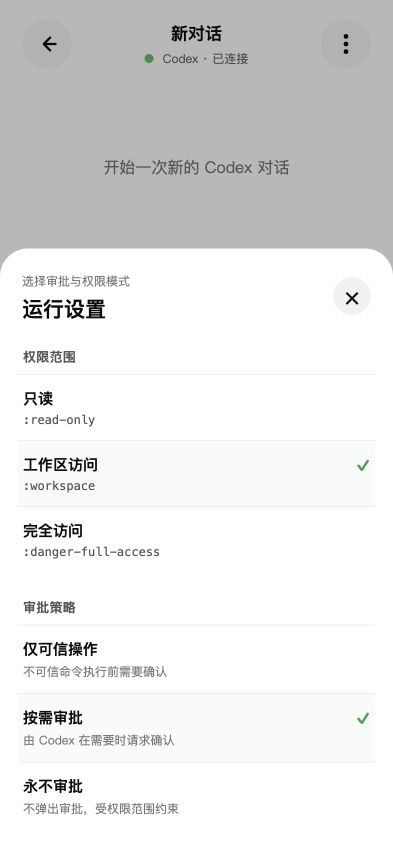
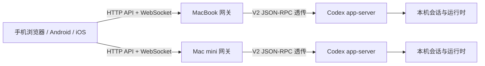

# Codex Mobile

[](https://github.com/loock-ai/codex-mobile/actions/workflows/build-android.yml)
[](https://www.npmjs.com/package/codex-mobile)
[](https://github.com/loock-ai/codex-mobile/releases/latest)
[](LICENSE)


**在手机上查看、继续和管理运行在 Mac 上的真实 Codex 工作流。**

Codex Mobile 是一个移动优先的 Codex Remote 客户端。它通过轻量网关直接连接官方
Codex `app-server` V2，复用真实会话、项目、工具调用和审批，并可在一个客户端中
同时管理多台 Mac。

[快速开始](#快速开始) · [核心能力](#核心能力) · [系统架构](#系统架构) ·
[移动端构建](#移动端构建) · [已知边界](#已知边界)

> Codex Mobile 是独立开源项目，与 OpenAI 官方没有隶属关系。

## 界面预览

| 会话列表 | 对话详情 | 设备设置 |
| --- | --- | --- |
|  |  |  |

## 快速开始

### 1. 安装网关

要求 Node.js 20 或更高版本，并确保本机已有可用的 `codex` CLI。

```bash
npm install -g codex-mobile
```

只在当前电脑访问：

```bash
codex-mobile start
```

默认打开 [http://127.0.0.1:18766](http://127.0.0.1:18766)。

### 2. 允许手机通过局域网连接

非回环监听必须配置访问口令：

```bash
HOST=0.0.0.0 \
CODEX_MOBILE_TOKEN='<随机口令>' \
codex-mobile start
```

在另一个终端显示连接地址和二维码：

```bash
codex-mobile auth
```

手机扫码后即可打开：

```text
http://<电脑局域网IP>:18766/?token=<随机口令>
```

纯文本脚本可使用 `codex-mobile auth --plain`。最近一次成功启动的实际端口和访问口令
保存在 `~/.codex-mobile/runtime.json`，文件权限为 `0600`。

### 3. 添加更多设备

在另一台 Mac 上用不同口令启动网关，然后在 Codex Mobile 的设备管理中输入其完整
地址。客户端会检查 `/api/host`，完成一次 WebSocket `initialize`，验证成功后保存
设备。

一个客户端最多保存 8 台设备，并可同时维持所有已启用设备的连接。

## 为什么做这个项目

Codex Desktop 很适合坐在电脑前完成开发任务，但长任务启动后，用户仍可能需要在
手机上：

- 查看进行状态和最终结果；
- 处理命令、文件修改和补充信息审批；
- 继续已有会话或快速发起新任务；
- 在 MacBook、Mac mini 等多台开发机器之间切换。

本项目不是把终端页面缩小后塞进 WebView，也不维护一套模拟 Codex 的聊天协议。
前端针对手机重新设计，业务数据仍来自真实的 Codex `app-server`。

## 核心能力

| 能力 | 说明 |
| --- | --- |
| 多设备 | 添加、测试、启停和切换多个网关；汇总各机器的连接与待审批状态 |
| 会话组织 | 全部机器时间流、单机项目分组、搜索、折叠、置顶、未读、重命名和归档 |
| 长会话 | 即时进入详情、骨架屏、错误重试、turns 分页和滚动位置保持 |
| 实时交互 | 流式消息、reasoning、工具调用、文件变更、停止运行中的 turn |
| 模型与权限 | 从 app-server 读取模型、推理强度、服务档位、权限和审批策略 |
| 审批 | 支持命令、文件修改、附加权限和 `requestUserInput` |
| 文件与媒体 | Markdown/GFM、图片输入、远程图片、远程文本、Markdown/HTML 预览和文件 Diff |
| 前后台恢复 | App 回到前台、网络切换或 WebSocket 半开时主动探测并恢复连接 |
| 多端复用 | 同一套前端运行于 Web、Android 和 iOS，不在 App 中固化后端地址 |

### 移动端交互

- 会话列表以侧边栏组织，标题与机器切换栏联合吸顶。
- “全部”视图按时间汇总多台机器；单机视图按本机项目目录分组。
- 项目目录先展示，会话并发加载、独立渲染和独立重试。
- 首屏只加载最近 10 个 turns，滚动到顶部继续加载旧历史。
- 工具、审批、文件、Diff 和状态信息使用适合触控的底部 Sheet 展示。
- 运行状态只显示在具体会话上，不把机器连接状态与任务运行状态混在一起。

## 系统架构



每台 Mac 运行自己的网关和 app-server，设备之间不互相代理。网关只负责：

- 提供静态前端，也可关闭静态资源进入 gateway-only 模式；
- 校验局域网访问口令；
- 提供 `/api/host`、`/api/status` 和 `/api/projects` 控制面；
- 在客户端 WebSocket 与回环地址上的 app-server 之间双向转发消息；
- 在 Managed 模式下启动和管理 app-server 生命周期。

网关不改写 app-server 的业务协议，不复制或长期保存会话内容，也不建立第二套会话
数据库。

## 运行模式

### Managed（默认）

网关自动启动并管理一个仅监听回环地址的 app-server：

```bash
CODEX_APP_SERVER_MODE=managed \
CODEX_APP_SERVER_PORT=18765 \
codex-mobile start
```

原始 app-server 不应监听局域网地址，只有网关对外提供服务。

### External

连接已经运行的 app-server，网关不管理其生命周期：

```bash
CODEX_APP_SERVER_MODE=external \
CODEX_APP_SERVER_URL=ws://127.0.0.1:18765 \
codex-mobile start
```

### Gateway-only

移动 App 已内置前端时，后端可以只提供控制面和 WebSocket：

```bash
CODEX_MOBILE_SERVE_STATIC=false codex-mobile start
```

此时网关根路径返回 `404`，`/api/*` 和 `/ws` 仍可使用。

## 配置

| 环境变量 | 默认值 | 说明 |
| --- | --- | --- |
| `HOST` | `127.0.0.1` | 网关监听地址；局域网访问使用 `0.0.0.0` |
| `PORT` | `18766` | 网关端口，也可通过 `start --port` 指定 |
| `CODEX_MOBILE_TOKEN` | 空 | 访问口令；非回环监听时必填 |
| `CODEX_MOBILE_HOST_ID` | 自动生成 | 稳定的设备标识 |
| `CODEX_MOBILE_HOST_NAME` | 主机名 | 客户端展示的设备名称 |
| `CODEX_MOBILE_UPLOAD_DIR` | `~/.codex/codex-mobile-uploads` | 图片以外附件的上传目录 |
| `CODEX_MOBILE_SERVE_STATIC` | `true` | 设为 `false` 启用 gateway-only |
| `CODEX_APP_SERVER_MODE` | `managed` | `managed` 或 `external` |
| `CODEX_APP_SERVER_PORT` | `18765` | Managed app-server 回环端口 |
| `CODEX_APP_SERVER_URL` | `ws://127.0.0.1:18765` | External 模式的上游地址 |
| `CODEX_HOME` | `~/.codex` | Codex 状态目录 |

内置 App 可能发送 `Origin: null` 或其他本地页面 Origin。网关允许跨来源访问控制面，
但 HTTP API 和 WebSocket 始终需要正确 Token。

## 从源码开发

```bash
git clone https://github.com/loock-ai/codex-mobile.git
cd codex-mobile
npm install
npm run dev
```

开发模式同时运行：

- Vite：`http://0.0.0.0:5173`，提供前端和 HMR；
- 网关：`http://0.0.0.0:18766`；
- Managed app-server：`ws://127.0.0.1:18765`。

`npm run dev` 默认读取：

```text
~/Library/Application Support/CodexMobileWeb/gateway.env
```

示例配置：

```bash
export HOST='0.0.0.0'
export PORT='18766'
export CODEX_APP_SERVER_MODE='managed'
export CODEX_APP_SERVER_PORT='18765'
export CODEX_MOBILE_HOST_ID='macbook-pro'
export CODEX_MOBILE_HOST_NAME='MacBook Pro'
export CODEX_MOBILE_SERVE_STATIC='false'
export CODEX_MOBILE_TOKEN='<独立口令>'
```

### 验证

```bash
npm run typecheck
npm test
npm run build
npm run test:e2e
```

## 移动端构建

[最新 GitHub Release](https://github.com/loock-ai/codex-mobile/releases/latest) 提供：

- Android APK 及 SHA-256 校验文件；
- 未签名 iOS IPA 及 SHA-256 校验文件。

Android App 会检查正式 Release，发现新版本后由用户确认下载，校验成功后调起系统
安装器。首次使用需要在 Android 系统中允许 Codex Mobile 安装未知应用，App 不支持
静默安装。

iOS IPA 未签名，安装到真实设备或上传 TestFlight 前仍需使用 Apple Developer 证书
签名。

仓库使用固定提交的 PakePlus Android/iOS 项目作为原生容器，并把当前 `dist/` 静态
资源内置到 App。构建产物不包含局域网 IP、网关 Token 或其他私人配置。

发布流程：

- `main` 的应用相关代码变化会触发 Android、iOS 构建和 GitHub Release；
- npm 包只在网关、CLI 或包配置变化时随同发布，也可在手动工作流中显式启用；
- Android、iOS 与同次发布的 npm 包共用一个解析后的版本号。

相关工作流：

- [build-android.yml](.github/workflows/build-android.yml)
- [build-ios.yml](.github/workflows/build-ios.yml)
- [publish-npm.yml](.github/workflows/publish-npm.yml)

## 项目结构

```text
codex-mobile/
├── bin/                  # npm CLI、访问地址和终端二维码
├── src/
│   ├── app-server/       # V2 客户端、会话恢复、分页与列表加载
│   ├── backends/         # 多设备注册表、探测和连接管理
│   ├── features/         # 会话、列表、审批、设置和设备管理 UI
│   └── ui/               # 消息、附件、图标和展示辅助逻辑
├── server/               # 透明网关、进程管理和项目目录读取
├── tests/                # 协议、服务端、UI、CI 和移动端 E2E 测试
├── protocol/             # app-server V2 协议基准与生成物
├── docs/plans/           # 设计与实施记录
└── .github/workflows/    # 移动端和 npm 发布流水线
```

协议基准见
[`protocol/app-server-v2/README.md`](protocol/app-server-v2/README.md)，总体设计见
[`docs/plans/2026-07-26-codex-mobile-web-design.md`](docs/plans/2026-07-26-codex-mobile-web-design.md)。

## 安全与仓库边界

- 非回环监听必须配置 Token；当前 Token 方案适用于可信局域网。
- 跨不可信网络使用时，应增加 HTTPS、可信反向代理和正式身份认证。
- 公开仓库和正式构建产物不包含局域网地址、访问口令、Codex 登录态、API 密钥、
  本机会话、用户项目内容或移动端签名材料。
- App 中保存的设备地址和 Token 位于客户端本地存储，不会提交到本仓库。

## 已知边界

- Codex app-server 协议会随 CLI 版本演进；分页、置顶等能力以实际运行版本为准。
- 大型会话的 `thread/read(includeTurns:true)` 响应可能很大，正常路径优先使用
  `thread/resume` 初始分页和 `thread/turns/list`。
- app-server 的持久化 `ThreadItem` 可能是有损表示，前端也会合并逻辑回合。
- 不同 app-server 进程之间没有全局实时状态。Codex Desktop 与本项目使用独立进程
  时，网页无法仅靠 V2 列表接口准确显示桌面进程正在执行的任务。
- iOS 自动化产物未签名；正式分发不在无证书构建范围内。

## 许可证

本项目使用 [Apache License 2.0](LICENSE)。
