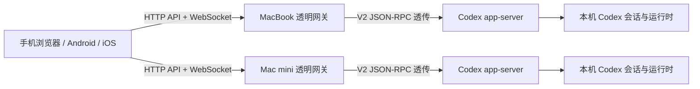

# Codex Mobile Web

一个面向手机与局域网场景的 Codex Remote 客户端。它使用 React 构建接近原生
移动 App 的会话体验，通过轻量网关直接连接官方 Codex `app-server` V2
双向 JSON-RPC，同时支持浏览器、Android 和 iOS 三种使用形态。

> 当前版本：`0.2.0`
>
> 许可证：Apache-2.0

## 项目背景

Codex Desktop 适合在电脑上完成开发任务，但在离开桌面、查看长任务进度、处理审批
或继续一段会话时，手机端缺少轻量、完整且适合触控的入口。直接复用桌面网页会带来
布局密度、移动端交互和多设备管理问题；直接让浏览器连接原始 `app-server`，又会
暴露进程管理、浏览器握手和局域网访问控制等边界。

本项目因此采用“移动优先前端 + 透明网关 + 官方 app-server”的结构：

- 前端参考 ChatGPT Android Remote 的信息层级和交互习惯，但不复制私有实现。
- 业务协议直接使用 Codex `app-server` V2，不建立另一套会话数据库或业务 API。
- 每台 Mac 运行自己的网关和 app-server，手机可以同时连接多台设备。
- Web 与移动 App 复用同一份前端；App 内置静态资源，但不内置后端地址或口令。

它的目标不是替代 Codex Desktop，而是为局域网和可信网络中的移动查看、继续对话、
审批与多设备切换提供一个独立入口。

## 产品目标

项目需求由现有开发会话归并为以下几条主线：

1. **保持协议兼容**：尽量透明地使用官方 app-server 方法、通知和审批请求。
2. **提供原生感移动体验**：紧凑布局、安全区适配、侧边栏、吸顶控件、底部 Sheet
   和适合触控的输入区。
3. **管理多台 Codex 设备**：一个客户端最多保存 8 个网关，同时维持已启用设备的
   连接、运行状态和待审批数量。
4. **让大量会话仍然可用**：按机器和项目组织会话，渐进加载项目列表，并对长会话
   使用 turns 分页。
5. **覆盖真实工作流**：继续已有会话、新建任务、选择模型与权限、上传图片、处理中断
   与审批、查看工具调用、文件和 Diff。
6. **同时支持 Web 与移动 App**：普通浏览器直接访问网关；Android/iOS App 内置前端，
   首次启动时由用户添加设备。

## 核心能力

### 多设备与会话组织

- 添加、测试、启用、停用和切换多个设备网关，配置保存在客户端
  `localStorage`。
- “全部”视图汇总所有机器的会话并按时间排序；单机视图按项目目录分组。
- 支持会话搜索、项目折叠、置顶、未读状态、重命名和归档。
- 会话列表标题与机器切换栏联合吸顶；运行状态只归属于具体会话。
- 项目目录先返回先展示，各项目的最近会话并发请求、独立渲染和独立重试。

### 移动对话体验

- 点击会话立即进入详情，历史数据返回前显示骨架屏；失败时保留详情并支持重试。
- 使用 Markdown/GFM 渲染消息，按真实用户消息合并逻辑回合，折叠冗长过程消息。
- 实时合并 turn、reasoning、工具和文件变更事件，并支持停止正在运行的 turn。
- 首次只加载最近 10 个 turns，滚动到顶部继续分页加载旧历史，并保持阅读位置。
- 支持流式滚动跟随、未读提示、图片输入和远程图片查看。

### 模型、权限与审批

- 模型、推理强度和服务档位来自 app-server，不维护只用于展示的固定选项。
- 支持权限模式与审批策略，并在恢复会话时同步实际设置。
- 支持命令、文件修改、附加权限和 `requestUserInput` 等审批交互。
- 多设备场景会汇总待审批数量，并提示审批来自哪台机器。

### 工具与文件

- 展示工具调用、推理过程、用量、错误和文件变更。
- 将 `fileChange` 渲染为适合手机阅读的文件级 Diff。
- 识别消息中的远程文件路径，通过 `fs/readFile` 读取并在底部面板展示文本或图片。
- 网关保持协议透传，不在服务端复制或长期保存会话内容。

### Web、Android 与 iOS

- 普通 Web 页面默认把当前 HTTP(S) 来源注册为第一个设备。
- 打包后的 App 从本地静态资源启动，不预置局域网 IP、后端地址或 Token。
- App 首次启动自动打开“添加设备”，验证 `/api/host` 和 WebSocket 后保存配置。
- GitHub Actions 使用固定版本的 PakePlus 平台项目生成 Android APK 和 iOS IPA。
- Android 产物可用于测试；iOS 当前生成未签名 IPA，正式安装或 TestFlight 分发仍需
  Apple Developer 签名。

## 系统架构



透明网关只负责：

- 提供静态前端（可关闭）。
- 校验局域网访问口令。
- 提供 `/api/host`、`/api/status` 和 `/api/projects` 控制面。
- 在浏览器 WebSocket 与回环地址上的 app-server 之间双向转发消息。
- 在 Managed 模式下启动并管理 app-server 生命周期。

网关不会改写 app-server 的业务协议，也不会把会话写入额外数据库。每个
app-server 只知道由它管理或持久化的任务状态；独立的 Codex Desktop app-server
进程不会自动与本项目同步实时运行态。

## 运行模式

### Managed 模式（默认）

网关自动启动并管理一个仅监听回环地址的 app-server：

```bash
CODEX_APP_SERVER_MODE=managed \
CODEX_APP_SERVER_PORT=18765 \
npm start
```

适合独立部署。原始 app-server 不应监听局域网地址，只有网关监听对外地址。

### External 模式

连接已经运行的 app-server，网关不管理其生命周期：

```bash
CODEX_APP_SERVER_MODE=external \
CODEX_APP_SERVER_URL=ws://127.0.0.1:18765 \
npm start
```

### Gateway-only 模式

移动 App 已内置前端时，后端可以只提供控制面和 WebSocket：

```bash
CODEX_MOBILE_SERVE_STATIC=false npm start
```

此时访问网关 `/` 会返回 `404`，客户端仍可通过 `/api/*` 和 `/ws` 连接。

## 快速开始

环境要求：

- Node.js 20 或更高版本。
- npm。
- 可用的 `codex` CLI；Managed 模式需要其支持 `codex app-server`。

安装、构建并启动：

```bash
npm install
npm run build
npm start
```

默认地址为 `http://127.0.0.1:4173`。

允许局域网访问时，服务监听 `0.0.0.0:4173`，并且必须配置访问口令：

```bash
HOST=0.0.0.0 \
CODEX_MOBILE_TOKEN='<随机口令>' \
npm start
```

手机打开：

```text
http://<Mac局域网IP>:4173/?token=<随机口令>
```

首次携带正确 Token 访问后，网关会写入 HttpOnly Cookie。Token 是轻量局域网保护；
跨不可信网络使用时应增加 HTTPS、可信反向代理和正式认证。

## 主要配置

| 环境变量 | 默认值 | 说明 |
| --- | --- | --- |
| `HOST` | `127.0.0.1` | 网关监听地址；局域网访问使用 `0.0.0.0` |
| `PORT` | `4173` | 网关端口 |
| `CODEX_MOBILE_TOKEN` | 空 | 网关访问口令；非回环监听时必填 |
| `CODEX_APP_SERVER_MODE` | `managed` | `managed` 或 `external` |
| `CODEX_APP_SERVER_PORT` | `18765` | Managed app-server 回环端口 |
| `CODEX_APP_SERVER_URL` | `ws://127.0.0.1:18765` | External 模式上游地址 |
| `CODEX_MOBILE_HOST_ID` | 自动生成 | 稳定的设备标识 |
| `CODEX_MOBILE_HOST_NAME` | 主机名 | 客户端展示的设备名称 |
| `CODEX_MOBILE_SERVE_STATIC` | `true` | 设为 `false` 启用 gateway-only |
| `CODEX_HOME` | `~/.codex` | Codex 状态目录 |

内置 App 可能发送 `Origin: null` 或其他本地页面 Origin。网关允许跨来源访问控制面，
但 HTTP API 和 WebSocket 始终需要正确 Token；非回环监听不能省略 Token。

## 多设备开发

调试阶段可以由 MacBook 提供 Vite 前端和本机网关，其他设备只运行自己的
gateway-only 后端。准备
`~/Library/Application Support/CodexMobileWeb/gateway.env`：

```bash
export HOST='0.0.0.0'
export PORT='4173'
export CODEX_APP_SERVER_MODE='managed'
export CODEX_APP_SERVER_PORT='18765'
export CODEX_MOBILE_HOST_ID='macbook-pro'
export CODEX_MOBILE_HOST_NAME='MacBook Pro'
export CODEX_MOBILE_SERVE_STATIC='false'
export CODEX_MOBILE_TOKEN='<MacBook-独立口令>'
```

启动开发模式：

```bash
npm run dev
```

该命令同时运行：

- Vite：`http://0.0.0.0:5173`，提供前端和 HMR。
- 网关：`http://0.0.0.0:4173`。
- Managed app-server：`ws://127.0.0.1:18765`。

其他机器使用独立的 `CODEX_MOBILE_HOST_ID`、名称和 Token。手机打开 Vite 页面后，
在设备管理界面输入另一台机器的完整网关地址：

```text
http://<设备局域网地址>:4173/?token=<该设备口令>
```

客户端会检查 `/api/host` 并完成一次 WebSocket `initialize`，验证成功后保存设备。
设备 IP 变化时只需更新客户端地址，不需要维护跨域白名单。

## 移动 App 构建

仓库包含两个 GitHub Actions 工作流：

- `.github/workflows/build-android.yml`
- `.github/workflows/build-ios.yml`

流水线先构建当前仓库的 `dist/`，再把静态资源放入固定版本的 PakePlus 原生容器。
产物只包含通用前端，不包含固定后端地址、局域网 Token 或私有配置。

Android 流水线保留手动构建，同时在 `main` 的前端代码发生变更时自动执行完整测试、
增加补丁版本并发布 GitHub Release。Release 包含 APK 和 SHA-256 校验文件。Android
App 会自动检查正式 Release；发现新版本后由用户确认下载，校验通过后调起系统安装器。
首次使用需要在 Android 系统中允许 Codex Mobile 安装未知应用，App 不支持静默安装。

iOS 流水线仍为手动构建，生成未签名 IPA；正式分发需在自己的 Apple Developer 环境中
完成签名。

## 项目结构

```text
codex-web-mobile/
├── src/
│   ├── app-server/       # V2 客户端、会话恢复、分页与列表加载
│   ├── backends/         # 多设备注册表、探测和连接管理
│   ├── features/         # 会话、列表、审批、设置和设备管理 UI
│   └── ui/               # 消息建模、附件、图标与展示辅助逻辑
├── server/               # 透明网关、app-server 进程管理和项目目录读取
├── tests/                # 协议、服务端、UI、CI 与移动端 E2E 测试
├── protocol/             # app-server V2 协议基准与生成物
├── docs/plans/           # 已确认的设计与实施记录
└── .github/workflows/    # Android / iOS 打包流水线
```

## 验证

```bash
npm run typecheck
npm test
npm run build
npm run test:e2e
```

协议基准见
[`protocol/app-server-v2/README.md`](./protocol/app-server-v2/README.md)，总体设计见
[`docs/plans/2026-07-26-codex-mobile-web-design.md`](./docs/plans/2026-07-26-codex-mobile-web-design.md)。

## 已知边界

- Codex app-server 协议随 CLI 版本演进；分页、置顶等能力应以实际运行版本生成的
  Schema 为准，客户端为部分旧版本保留了回退路径。
- `thread/read(includeTurns:true)` 对大型会话可能返回很大的响应；正常路径优先使用
  `thread/resume` 初始分页与 `thread/turns/list`。
- app-server 的持久化 `ThreadItem` 可能是有损表示，前端也会合并逻辑回合；历史详情
  应以实际 app-server 返回为准。
- 不同 app-server 进程之间没有全局实时状态。桌面 Codex 与本项目使用独立进程时，
  网页无法仅靠 V2 列表接口准确显示桌面进程正在执行的任务。
- 当前 Token 方案适用于可信局域网，不等同于面向公网的完整身份认证系统。
- iOS 自动化产物未签名；真实设备安装、推送和 TestFlight 不在当前仓库的无证书
  构建范围内。
