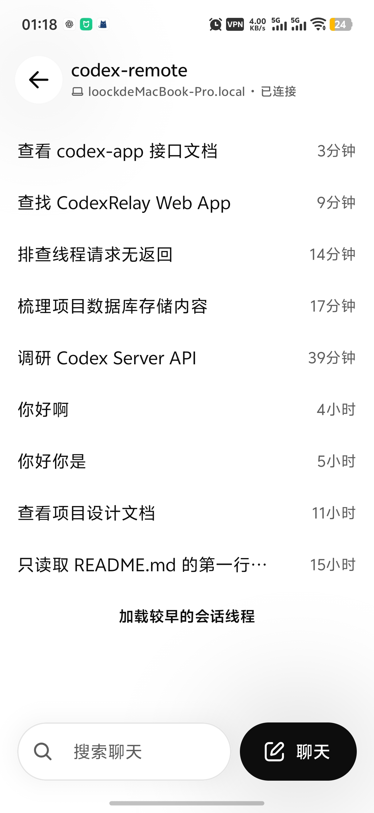
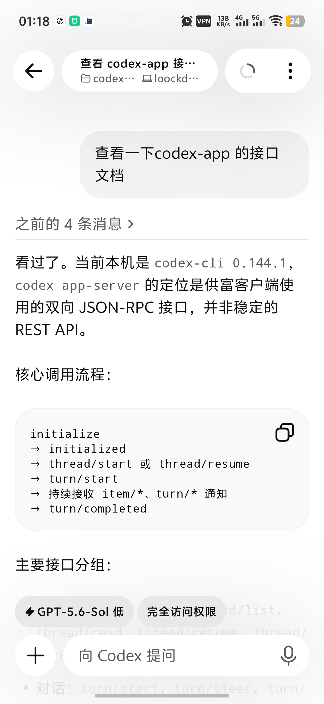
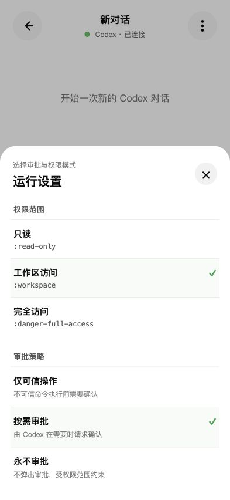
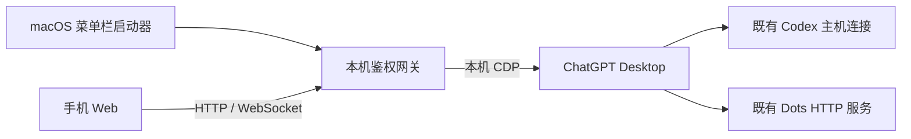

# Codex Mobile Launcher

[](LICENSE)

[](https://github.com/loock-ai/codex-mobile/releases/latest)

**在 Mac 上启动连接，在手机上继续桌面的 Codex 任务。**

Codex Mobile Launcher 是一个 macOS 菜单栏启动器。它负责启动和配置桌面连接，
提供手机可访问的 Web 页面，让你查看项目和会话、收发消息、处理审批，
也能在任务运行时补充引导，或者进入独立的 Dots 对话。

默认使用 **CDP 桌面桥接**：手机请求通过 ChatGPT Desktop 的既有服务执行，
使用桌面的会话和主机连接。启动器同时保留原 Codex Mobile 的托管和外部
app-server 模式。

[快速开始](#快速开始) · [日常操作](#日常操作) · [手机上可以做什么](#手机上可以做什么) ·
[连接设置](#连接设置) · [工作原理](#工作原理)

> 本项目独立开发，与 OpenAI 官方没有隶属关系。

## 快速开始

### 1. 构建启动器

需要 macOS、Node.js 20+，以及已安装并登录的 ChatGPT Desktop。
当前应用包以 Apple Silicon 为主，尚未签名，需从源码构建。

```bash
git clone https://github.com/loock-ai/codex-mobile.git
cd codex-mobile
npm install
npm run package:launcher
```

打开生成的应用：

```bash
open "launcher-release/mac-arm64/Codex Mobile Launcher.app"
```

只运行源码版面板，也可使用：

```bash
npm run build:launcher
npm run launcher
```

### 2. 连接桌面

点击 Mac 菜单栏的 `⌘` 图标打开启动器。

1. 在 **设置** 中选择 **CDP 桌面桥接**，核对 ChatGPT 应用路径并保存。
2. 点击 **启动并打开 Web**，启动器会建立连接并打开网页。
3. 如果 ChatGPT 已运行但没有开启 CDP，点击 **强制重启**，重新启动桌面并连接。

**强制重启**直接终止所配置 ChatGPT 安装包的主进程，随后以 CDP 参数启动。
该操作不弹确认框，运行中的任务、草稿和审批也不会阻拦重启。

### 3. 在手机上打开

手机与 Mac 连接同一网络，在启动器中点击 **展开二维码**后扫码，
或点击 **复制连接链接**，把完整链接发送到手机浏览器。

二维码默认收起，可再次点击收起。完整链接包含访问口令，请使用复制功能，
不要只输入界面中显示的地址。

手机打开后，选择项目和会话即可继续操作。启动器默认使用：

| 项目 | 默认值 |
| --- | --- |
| 手机 Web 网关 | `19877` |
| 本机桌面 CDP | `9333` |
| 手机访问范围 | 局域网 |
| ChatGPT 应用 | `/Applications/ChatGPT.app` |

## 日常操作

| 按钮或页面 | 用途 |
| --- | --- |
| 启动并打开 Web | 建立连接后打开网页 |
| 打开 Web | 已启动时直接打开连接页面 |
| 展开／收起二维码 | 按需显示手机扫码入口 |
| 复制连接链接 | 复制包含访问口令的完整链接 |
| 停止连接 | 关闭启动器自己的网关，保留 ChatGPT 桌面应用 |
| 强制重启 | 直接强制重启 ChatGPT、开启 CDP 并重新连接 |
| 打开 ChatGPT | 打开配置的桌面应用 |
| 设置 | 修改连接模式、端口、访问范围和口令；修改前需停止连接 |
| 审批 | 查看等待处理的请求，并进入 Web 回答 |
| 日志 | 查看启动和连接失败原因，日志隐藏访问口令 |

关闭启动器面板后，连接会继续运行。退出启动器会停止它管理的连接服务。

### 通过命令打开 Web

在源码目录完成构建后：

```bash
node bin/codex-mobile.mjs launcher --open-web
```

使用打包应用：

```bash
open -n "launcher-release/mac-arm64/Codex Mobile Launcher.app" --args --open-web
```

命令使用已保存的配置，连接成功后打开 Web。启动器已有实例时会转交命令，
不会重复创建网关。

## 手机上可以做什么

| 功能 | 说明 |
| --- | --- |
| 项目与会话 | 获取所选主机的项目、会话列表和历史记录，长会话分页加载 |
| 收发消息 | 向桌面会话发送消息，查看回复、推理摘要和工具执行情况 |
| 运行中引导 | 任务运行时补充要求，继续当前任务，也可携带附件 |
| 审批与问题 | 处理命令、文件修改、权限请求和用户问题 |
| 非阻塞提问 | 问题卡片可收起、稍后回答，任务继续执行 |
| 模型与权限 | 查看并选择桌面提供的模型、思考强度和权限配置 |
| 图片与文件 | 上传附件、查看消息内容及可用的远程文件 |
| 远程主机 | 连接测试后选择需要展示的主机，在设备管理中分别开启或隐藏 |
| 多设备 | 保存多个 Mac 的网关连接，切换或汇总查看会话 |
| Dots | 独立入口，支持消息历史、文字、图片和文件发送 |

Dots 输入框和消息列表复用普通对话样式，隐藏滚动条但保留滚动。
每条消息最多 4 个附件，单个不超过 20 MiB，也可以只发送附件。
上传失败保留草稿；消息投递结果未知时保留核对记录，不自动重发。

| 会话列表 | 对话详情 | 设备设置 |
| --- | --- | --- |
|  |  |  |

## 连接设置

启动器提供三种模式：

| 模式 | 适用场景 |
| --- | --- |
| CDP 桌面桥接（默认） | 通过 ChatGPT Desktop 的既有连接控制桌面会话 |
| 原 app-server · 启动本机服务 | 由启动器启动并管理独立 app-server |
| 原 app-server · 连接已有服务 | 接入已运行的本机 app-server |

原 app-server 模式使用所选 Desktop 安装包内的 CLI，自动根据安装包布局查找，
不依赖全局 `codex` 路径。独立 app-server 进程不保证与桌面的运行状态同步。

配置保存在启动器的本机用户数据目录，配置文件权限为 `0600`。
默认不会设置开机启动；CDP 只监听本机，手机通过带访问口令的网关连接。

详细说明见 [桌面启动器指南](docs/desktop-launcher.md)。原 npm CLI、环境变量和
Android／iOS 构建说明见 [原 app-server 与移动端构建指南](docs/app-server-guide.md)。

## 工作原理


```mermaid
flowchart LR
    L["macOS 菜单栏启动器"] --> G["本机鉴权网关"]
    P["手机 Web"] -->|HTTP / WebSocket| G
    G -->|本机 CDP| D["ChatGPT Desktop"]
    D --> C["既有 Codex 主机连接"]
    D --> T["既有 Dots HTTP 服务"]
```

启动器负责配置、进程和连接生命周期。网关通过 CDP 调用桌面已有的
Electron／AppHost 服务，把手机请求发送到所选本机或远程主机。
CDP 模式不另起一套 Codex 会话进程，也不建立第二套持久化会话数据库。

程序调用接口见 [桌面程序控制通道](docs/desktop-control-channel.md)，
Dots 的房间、附件和身份处理见 [Dots 适配](docs/dots-adapter.md)。

## 当前边界

- Dots 与原生用户问题快照绑定桌面版本 `26.1002.52244`，升级桌面后可能需要更新适配。
- 普通权限审批尚无完整的快照补读；非阻塞用户问题有单独快照适配。
- Dots 接收采用前台轮询，暂不支持语音、创建 Dot 和复杂交互审批。
- 桌面新任务的云端工作位置选择尚未接入。
- 自动化覆盖受控 Electron 和浏览器链路，真实账户兼容性仍需实际使用确认。
- 当前访问口令方案适用于可信局域网；跨不可信网络连接应增加 HTTPS 和正式身份认证。

## 开发与验证

```bash
npm run typecheck
npm test
npm run build:launcher
```

启动器、桌面通道和 Dots 的受控浏览器测试：

```bash
RUN_CDP_FIXTURE=1 npx vitest run \
  tests/server/launcher-panel.integration.test.ts \
  tests/server/control-interactive.integration.test.ts \
  tests/server/dots-web.integration.test.ts
```

## 许可证

本项目使用 [Apache License 2.0](LICENSE)。
