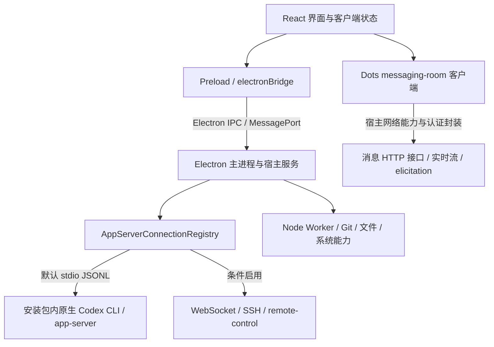

# 当前 ChatGPT/Codex 桌面端实现架构分析

分析日期：2026-10-02。对象：`/Applications/ChatGPT.app` 内的 `app.asar`，包名 `openai-codex-electron`，版本 `26.930.21537`。这是本机安装包静态分析，不是官方 TypeScript 源码仓库，也没有对真实账号调用发送或审批。下文区分代码事实、架构推断与待验证项。

桌面端的界面和大量宿主业务是 JavaScript，但执行核心还包含原生 Codex CLI、系统扩展和远端服务。Electron 本身也包含 Chromium。不能将整个应用视为一个浏览器中的聊天网页。



这张图表示逻辑关系；某条网络请求具体经 legacy fetch IPC 还是较新的 AppHost RPC，需要分别沿客户端实例定位，不把所有 Dots 请求说成 renderer 直接裸 fetch。

## 1. 启动与分包

`app.asar/package.json` 的 main 为 `.vite/build/early-bootstrap.js`。

早期入口先配置 Chromium switches、注册应用协议、处理路径打开队列、初始化网络权限，再加载 `bootstrap-yYZ8rgHq.js`。主进程实现还分布在 `main-C3nRcJ3D.js`、`application-network-startup-DN7Ktmlk.js` 等打包模块中。文件名中的哈希与压缩函数名随版本变化，不适合作为稳定 API。

Renderer 来自 `webview/`，主要共享模块包括 `app-shared-59042e7300f7.js`、`app-initial-60d038a052d7.js`、`app-primary-c9f7ac16cee9.js`，按页面继续懒加载。可以看到 React、React Router、查询缓存、共享状态和独立功能组件。

## 2. Renderer 与宿主之间的桥

`.vite/build/preload.js` 使用 `contextBridge.exposeInMainWorld` 暴露 `electronBridge` 与 `codexWindowType`。它不是把完整 Node API 暴露给页面，而是提供有限能力，例如：

- `sendMessageFromView`：通过 `ipcRenderer.invoke` 发送宿主消息。
- `sendWorkerMessageFromView`、`subscribeToWorkerMessages`：后台任务消息。
- 初始侧栏、共享状态快照、主题、文件拖拽、宿主会话与版本信息。

核心 IPC channel 是 `codex_desktop:message-from-view` 和 `codex_desktop:message-for-view`。入站消息经过 preload 向页面派发 message event；客户端分发器据此更新状态。大消息另有分块、序号与确认机制，不能只监听普通小 JSON 消息就声称覆盖了全部历史。

还存在较新的 `connect-app-host`：renderer 提供 MessagePort，preload 通过 `ipcRenderer.postMessage` 交给宿主；安装包依赖包含 capnweb，宿主服务使用此类 RPC 能力。Legacy typed IPC 与 AppHost RPC 并存，不能把前者当作全部功能接口。

## 3. Codex 的执行链

主进程维护 `AppServerConnectionRegistry`，按 hostId 选择连接。`main-C3nRcJ3D.js` 中可直接看到消息分发：

| UI 宿主消息 | 主进程动作 |
| --- | --- |
| mcp-request | 选定 host 的 handleClientRequest |
| mcp-notification | handleClientNotification |
| mcp-response | handleClientResponse，用于服务器请求/审批的回答 |
| mcp-request-abandon | 结束对应客户端请求的交付跟踪 |
| thread-prewarm-start | 预热线程并保存环境配置 |

这里的 mcp-* 是桌面内部消息名字。被封装的业务请求仍包含 app-server JSON-RPC 的 id/method/params，不能因此把桌面协议与外部 MCP server 混为一谈。

`application-network-startup-DN7Ktmlk.js` 的默认本地 transport kind 是 stdio。CLI 输出按行读取，发送写入 stdin 并加换行。连接管理层做 initialize、版本/能力协商、排队、超时、取消、重连、事件分发和请求归属；不是原样把所有数据广播给所有客户端。

安装包 CLI 的用户入口：

```text
ChatGPT.app/Contents/Resources/codex-cli/bin/codex
```

原生执行文件：

```text
ChatGPT.app/Contents/Resources/codex-cli/CodexCLI.app/Contents/MacOS/codex
```

代码另支持 WebSocket、SSH、remote-control。还存在 `CODEX_APP_SERVER_USE_LOCAL_DAEMON=1` 的本地 daemon 分支，经 `app-server-control/app-server-control.sock` 连接；它受配置覆盖、显式 CLI override、平台和版本等条件限制，并非当前可随意接入的已验证共享服务。本轮没有读取当前运行实例的连接内部状态，因此这里说明的是代码默认路径及可选分支。

官方公开的 app-server 和 Rust 核心见 [openai/codex](https://github.com/openai/codex/tree/main/codex-rs/app-server)。本机可以读到 Electron 打包 JS，不代表官方完整桌面应用开源。

## 4. Codex 消息与审批

请求路径为：UI 客户端生成请求身份 → 宿主 IPC → host 的连接管理器 → app-server → 宿主路由响应/事件 → renderer 更新会话与消息状态。

服务端流式事件包括 turn/started、item/started、消息增量、item/completed、turn/completed。界面从客户端状态渲染，DOM 是投影，可能因折叠、虚拟化、尚未加载、隐藏页面而不完整。

审批是反方向服务器发起的请求，带原始请求 ID 和 host/thread 等归属；用户回答后，以对应 response 回到同一连接。主进程对 mcp-response 有明确处理，并存在客户端请求交付跟踪与 originWebContentsId。不能使用新 ID 代替原审批 ID，也不能假设任意新 websocket 连接可以回答桌面的 pending request。

`sendMessageFromView` 的 invoke 完成只表示宿主调用完成，不能视为模型回复或业务结果。最终 RPC response 和生成事件还会异步推回 renderer。

## 5. Dots 是不同的产品链路

路由常量在 app-shared 中：`/dots/:conversationId` 与 `/o/:conversationId`；另有 home/new/claim-email/approve 路由。`orbit-conversation-route` 懒加载 messaging-room；主要代码在 `native-room-87b643e97ce2.js` 与 `composer-controls-948222e6c0f2.js`。

Dots 会话涉及 conversationId/tboId、messaging_room_id、messageId、requestId 等多个 ID，不是只用一个本地 Codex threadId。

安装包中实际出现的接口：

| 能力 | 接口模式 |
| --- | --- |
| 房间信息 | GET /messaging/rooms/{room_id} |
| 历史分页 | GET /messaging/rooms/{room_id}/messages |
| 发送 | POST /messaging/rooms/{room_id}/messages |
| 实时流 | streamPost /messaging/rooms/{room_id}/live |
| 查询审批 | GET /messaging/rooms/{room_id}/messages/{message_id}/elicitation |
| 回答审批 | POST /messaging/rooms/{room_id}/messages/{message_id}/elicitation/response |
| Dot 与房间绑定 | /tbo/{tbo_id}/messaging-room、/tbo/{tbo_id}/root-thread |

发送实现带 optimistic message、request_id、idempotency_token、account identity 和 page context，并区分 pending、delivered、failed、unconfirmed 等状态。某些请求还涉及 App Attest。未知结果不是简单再点击一次发送。

Dots 审批 request 使用 snake_case 的 request_id/thread_id/turn_id，外加 roomId/messageId；包含一般确认和 browserAuth 等更复杂形态。按钮文字相同不代表同一个请求，认证/验证类请求也不是单次裸 HTTP POST 就完整实现。

Dots 可以关联后台线程与工具任务；这不意味着它的整个消息界面等于本地 CLI app-server。

## 6. 手机与桌面不同步的架构原因

现有原 codex-mobile 模式会独立启动 app-server。桌面已有自己的进程、连接、订阅、pending requests 和 renderer 状态；共享 CLI 安装文件或 ~/.codex 并不会共享这些内存对象。保存的历史相同也不等于实时状态和写入所有权相同。

此前 writer-lock 的实测属于历史证据：桌面持锁时外部 CLI 可以读历史但不能写，不应把独立 thread/unsubscribe 当作释放桌面连接的方法。本轮不将当时版本、PID 或端口当成当前事实。

## 7. 对启动器的建议与验证门槛

当前桥接处于：CDP → React 路由/DOM → 输入/点击 → 可见消息投影 → 仿 app-server 事件。它会受到输入框隐藏副本、页面模式、按钮文案、React 属性结构和消息虚拟化影响；前面的路由和编辑器报错正发生在这一层。

更合适的研究方向是把 CDP 用作接入通道，在 desktop 既有 renderer/client/host 服务链路中建立受控适配，订阅结构化状态与事件，减少 DOM 轮询。此建议属于架构推断，尚未验证直接注入兼容性。必须先完成：

1. Codex：找到当前客户端实例的请求入口；绑定正确 host/thread；请求 ID 命名空间与响应路由不能冲突。
2. 同步：确认手机发起事件能更新桌面的会话状态和当前窗口，不仅后台返回成功；同一服务进程本身也不足以证明 UI 同步。
3. 审批：复用原 pending request 的身份、处理人、失效/取消事件，避免手机与桌面重复响应；涉及系统验证时保持原机制。
4. Dots：复用既有房间客户端、认证和发送完整性机制，支持 live stream 与 elicitation，不另开裸 API 客户端绕过桌面能力。
5. 重连：恢复事件订阅与状态快照，未知写入不自动重发。
6. 版本适配：探测桥和客户端契约；不满足契约时 fail closed，给出可读诊断。

因此可保留当前手机前端与兼容协议外壳，但后端核心需要分出 Codex adapter 和 Dots adapter。不能把两者都硬塞进输入框点击器，就声称获得完整可靠的同步。

本轮只分析，没有替换后端或操作真实会话。

## 8. 补充上一问的配置发现

早期入口确实读取私有 `CODEX_ELECTRON_CHROMIUM_SWITCHES`（JSON switch map），但只在 buildFlavor=dev 时采用。build-flavor 解析器又允许 `BUILD_FLAVOR` 环境变量覆盖包元数据。因此“完全没有环境变量入口”并不准确：代码存在一条开发构建路径。

这不是已经验证的发行版用户设置。改变 build flavor 同时影响更新器、调试能力等条件，不能只把它当作独立 CDP 开关。本轮未更改这些环境变量，也未验证 Finder 默认启动时能否使用它。

参考：[Electron 进程模型](https://www.electronjs.org/docs/latest/tutorial/process-model)、[Electron IPC](https://www.electronjs.org/docs/latest/tutorial/ipc)、[OpenAI App Server 架构介绍](https://openai.com/index/unlocking-the-codex-harness/)。本机路径、函数和消息形态以上述安装包静态代码为主要依据。

## 9. 对话与通知接入清单（2026-10-02 补充）

本轮重新读取安装版本，并将已提取的 preload、main、bootstrap、app-shared、app-initial 五个文件与当前 app.asar 逐字节比较，全部一致。以下名称是当前包内证据，不是公开稳定 API，也未对真实账号执行调用。

### 9.1 对话消息桥的方向与字段

| 方向 | 消息 | 已确认的关键字段与用途 |
| --- | --- | --- |
| renderer → host | mcp-request | hostId、request.id/method/params；进入 handleClientRequest，携带发起窗口身份 |
| host → renderer | mcp-response | hostId、message；message 是请求结果，注意不是 response 字段 |
| host → renderer | mcp-notification | hostId、method、params；会话、输出与状态事件 |
| host → renderer | mcp-request | hostId、request；服务器要求审批或补充输入 |
| renderer → host | mcp-response | hostId、response；response 带原请求 id，进入 handleClientResponse |

同名消息在不同方向形状不同。preload 的 sendMessageFromView 只等待 IPC invoke；不能将其返回值当作业务 JSON-RPC 结果。bootstrap 的 sendClientResponse 优先回原窗口，窗口不可用时存在广播回退；pending request 与窗口归属必须一起处理。

优先研究的业务事件：

- 生命周期：thread/started、thread/status/changed、turn/started、turn/completed。
- 消息流：item/started、item/agentMessage/delta、item/completed。
- 工具进度：item/commandExecution/outputDelta、item/fileChange/outputDelta、item/fileChange/patchUpdated、item/mcpToolCall/progress。
- 审批清理：serverRequest/resolved。
- 服务端交互请求：item/commandExecution/requestApproval、item/fileChange/requestApproval、item/permissions/requestApproval、item/tool/requestUserInput、item/tool/requestOptionPicker。

不能只处理同意/拒绝两个按钮；输入问题、选项选择、权限请求的响应结构各不相同。

### 9.2 比 DOM 更接近界面状态的订阅点

app-shared 中有 addConversationStateCallback、addConversationPatchesListener、addNotificationCallback、addStreamRoleStateCallback、addStreamFollowersChangedCallback，返回对应的取消订阅函数。emitConversation、emitConversationPatches 等方法驱动回调。bootstrap 还出现活动会话跟踪、被动会话释放、resume 事件缓冲。

这些是寻找现有会话管理实例的依据，不能据此假定它们挂在 window 上。需要继续确定实例生命周期、导出位置、快照获取方式，以及 stream role / follower 的所有权规则。低层请求成功不等于桌面的乐观消息、历史缓存和当前页面都已更新。

AppHost 通过 MessageChannel/MessagePort 建立 RPC，服务中包括 notifications、threadMetadata、threadArchive、threadReadState、clientCoordination 等。主进程还有 subscribeThreadObservations，但已看到的用途是会话目录观察，不能把它当作完整正文流订阅。

### 9.3 系统通知是独立通道

main 中 notifications 服务实例对应 JWe 类，存在以下方法：

| 方法/机制 | 代码确认的行为 | 对手机同步的作用 |
| --- | --- | --- |
| show(payload, callback) | 交给 desktopNotificationManager；支持打开、action、reply 回调；可根据回调返回路径导航 | 可研究复用桌面提醒，不能代替消息流 |
| hide(options) | 按 notificationId、conversationId 或 navigationPath 撤销 | 可研究在审批解决后清除提醒 |
| previewSound / importSound | 试听、导入提示音 | 与同步正文无直接关系 |
| macOS APNs 注册 | registerForAPNSNotifications 后请求 /notifications/subscription/register | 属于账号与设备推送；不是手机事件订阅接口 |

桌面通知创建参数包含 title、body、silent、sound、actions、hasReply；事件包括 click、action、reply、close。APNs 另有 /notifications/subscription/deregister/token。不要把推送 token 当作会话同步凭据。

### 9.4 对当前启动器的判断

优先级为：现有会话管理器的快照与补丁 → 既有 host 桥的结构化事件 → DOM 可见内容作为有限降级。Codex 和 Dots 应分别适配；Dots 继续研究 room 的 history/live/elicitation 客户端。

最小验证应覆盖：同一会话桌面输入后手机收到增量；手机输入后桌面显示用户消息与增量；任一端审批后另一端清除；断线重连恢复快照且不重发未知结果的写入。当前仍是静态证据，尚未完成这些实际桌面验证。

可复查的静态源位置：/tmp/desktop-architecture-audit/{preload.js,main-C3nRcJ3D.js,bootstrap-yYZ8rgHq.js} 与 /tmp/desktop-static-audit/app-shared-59042e7300f7.js。临时目录可能清理，长期权威对象是本机对应版本 app.asar。

## 10. 项目、会话目录与历史读取

本节补齐列表读取层。除安装包调用点外，使用安装包内 CLI 离线执行 `app-server generate-json-schema --experimental`，结果在 `/tmp/codex-desktop-protocol-audit-20261002`。生成协议文件不启动对话，也不意味着已连接桌面现有服务。以下示例是协议参数示意，未对真实桌面发送。

### 10.1 Codex 项目列表与桌面显示项目

底层 `project/list` 参数为 cursor、limit、sortKey、sortDirection，返回 data、nextCursor。sortKey 可为 position 或 recencyAt。当前主进程的项目同步实现每页 limit=100，循环到 nextCursor=null。

```json
{"method":"project/list","params":{"cursor":null,"limit":100,"sortKey":"position","sortDirection":"asc"}}
```

Project 包含 id、name、roots（元素有 path）、metadata、position、createdAt、updatedAt、recencyAt。`project/read` 接收 `{projectId}`，返回 `{project}`。

要复刻桌面侧栏，还需要宿主维护的显示状态。现有 `get-global-state` 处理器接收 `{key}` 返回 `{value}`；其中 local-projects 经过 `getLocalProjectsForRenderer()` 转换路径。相关 key 包括：

- local-projects、remote-projects：本地与远端项目。
- project-order、pinned-project-ids：顺序和置顶。
- selected-project、project-appearances：选择状态和外观。
- thread-project-assignments、thread-project-membership-host-ids：会话归属。
- sidebar-project-thread-orders：项目内会话排序。

`get-global-state` 是宿主内部 fetch handler 名称，不是 app-server JSON-RPC 方法。更新由 global-state-updated 携带 keys 通知，客户端需要重读对应值。桌面旧项目 ID、app-server 项目 ID、ChatGPT backing 项目 ID 存在映射，不能直接互换；主进程明确维护 legacyProjectIdsByServerId 和 serverProjectsByLegacyId。

### 10.2 Codex 会话列表

```json
{"method":"thread/list","params":{"cursor":null,"limit":100,"archived":false,"sortKey":"recency_at","sortDirection":"desc","useStateDbOnly":true}}
```

返回 data、nextCursor；必须持续翻页才是完整范围。可选过滤包含 projectId、sectionId、cwd、searchTerm、sourceKinds、modelProviders、parentThreadId、ancestorThreadId。需要注意：

- projectId 省略表示所有项目，null 表示未归属项目，字符串表示指定服务端项目。
- sectionId 同样区分省略、null、指定值。
- cwd 是精确路径匹配，不能替代项目成员关系。
- archived=true 只列归档；false/null 列未归档。
- sourceKinds 省略或空数组默认交互来源，不代表所有后台来源。
- originators 的非空过滤仅 hosted backend 支持，本地 app-server 会拒绝。
- parentThreadId 与 ancestorThreadId 互斥，分别查询直接子线程和全部后代。
- useStateDbOnly=true 避免扫描 JSONL 修复元数据，与桌面已观察到的列表调用一致。

JSON-RPC 参数没有 hostId；hostId 属于桌面外层路由。跨电脑读取应按宿主分别请求，合并时保留 hostId 与 threadId。

### 10.3 桌面会话目录服务

AppHost 暴露 `services.localThreadCatalog`，有 readPage、readEntries、readThreadCount、readStatus、subscribeStatus、subscribeThreadObservations、requestSync 等方法。

readPage 的已观察到参数为 `{hostId,cursor,filter,limit,manualOrder,sortKey}`。本地页 limit 为 1–100；cursor 绑定宿主、过滤条件及排序，不能跨条件复用。readEntries 接收 `{hostId,threadId}` 数组。目录包含 SQLite local_thread_catalog 缓存，但直接读数据库会漏掉活动来源、账户过滤和同步状态，因此不是优先集成接口。

目录服务还会校验 chatgpt 来源的当前账号。subscribeThreadObservations 能更新会话摘要，不能当作全文增量。应将目录快照/通知与正文快照/流分开处理。

### 10.4 对话历史、搜索和置顶

| 能力 | 方法 | 关键参数 |
| --- | --- | --- |
| 会话元数据 | thread/read | threadId、includeTurns=false |
| 回合分页 | thread/turns/list | threadId、cursor、limit、itemsView、sortDirection |
| 回合内容分页 | thread/items/list | threadId、turnId（可选）、cursor、limit、sortDirection |
| 搜索会话 | thread/search | searchTerm、cursor、limit、archived、sourceKinds |
| 分组列表 | threadSection/list | 具体形状见生成 schema |

当前 renderer 先用 itemsView=notLoaded 获取 turn，再分页获取 item。thread/read 的 schema 明确提示分页会话不宜使用整段历史 hydration。turn 默认倒序；item 默认正序，桌面调用也会显式倒序取尾页后翻转。收到重复 cursor 要停止并报错，不能无限加载。

置顶还涉及 AppHost pinnedThreads 服务、section 及旧 pinned-thread-ids 迁移，不能只从普通 thread/list 第一页推断置顶会话。

### 10.5 普通 ChatGPT 项目与聊天是另一套列表

app-initial 的认证客户端调用点还包含：

| 能力 | 路径 | 已观察到参数 |
| --- | --- | --- |
| ChatGPT 项目侧栏 | GET /gizmos/snorlax/sidebar | cursor、limit、owned_only、conversations_per_gizmo |
| 项目内聊天 | GET /gizmos/{gizmo_id}/conversations | cursor、limit、owned_only |
| 普通聊天列表 | GET /conversations | offset、limit、order、is_archived、is_starred、conversation_origin 等 |
| 项目详情 | GET /gizmos/{gizmo_id_or_short_url} | 路径项目 ID，部分调用 include_file_limits |
| 聊天详情 | GET /conversations/{conversation_id} | 部分调用 num_turns、include_has_versions |

这些是桌面认证网络封装内的相对路径；不是可匿名使用的公开 API。ChatGPT 项目返回 cursor/items，普通列表使用 offset/limit；不要与 Codex 的 nextCursor/data 混用。Dots 的房间正文仍需由 tbo/root-thread/messaging-room 映射到对应 room，本轮未确认完整 Dot 枚举入口，不能宣称上述普通聊天列表覆盖所有 Dot。

### 10.6 获取完整侧栏的建议顺序

1. 获取当前 host 与账号来源，读取本地/远端/ChatGPT 项目及显示顺序。
2. 通过已有目录服务分页取会话，保留 sourceKind、hostId、threadId 与项目 ID 映射。
3. 合并置顶、手工分组、项目成员关系、归档过滤、未读状态。
4. 打开会话后读取元数据，按 turn/item 分页加载正文，再接该会话已有结构化事件。
5. 订阅项目状态失效、目录观察和审批解决事件；重连重取快照。

现在已确认接口与 schema，仍未确认从现有 renderer 获取所有服务实例的稳定入口，也未做真实项目列表与桌面侧栏逐项比对。本节不把离线协议生成当作端到端成功。
