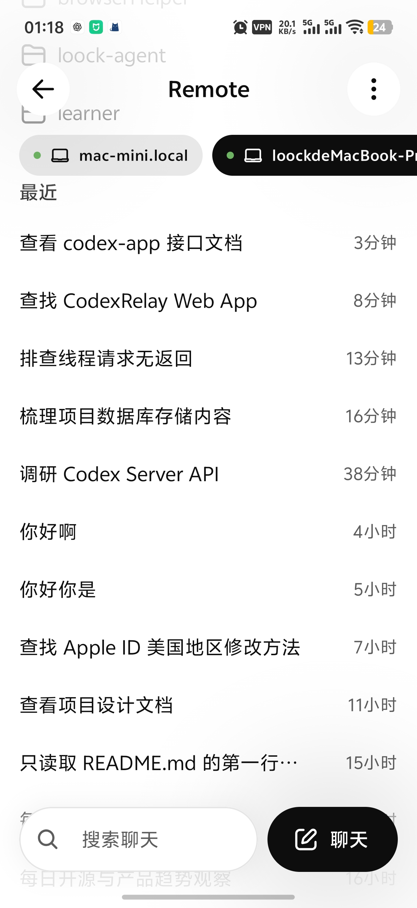
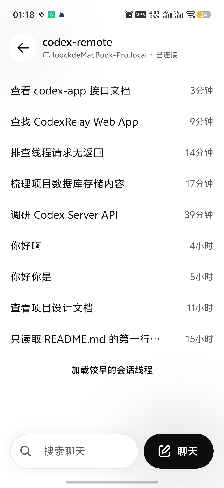
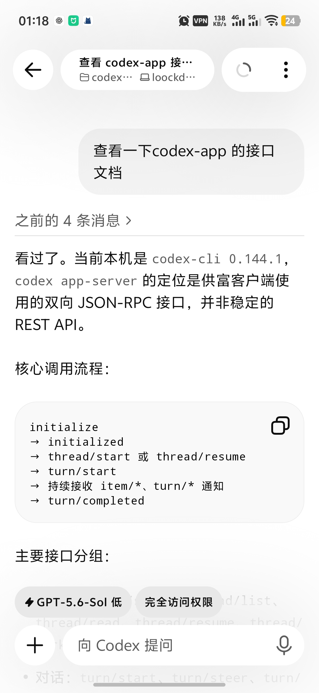

# Codex Mobile Web 设计

## 目标

构建一个仅用于局域网的 Codex Remote Web 客户端：

- 使用纯 Web/WAP 技术实现。
- 尽量复刻 ChatGPT Android 客户端 Remote 功能的原生界面与交互体验。
- 兼容官方 `codex app-server` 协议。
- 通过轻量透明网关连接 `codex app-server`。
- 第一版形成查看任务、继续对话、审批操作和查看 Diff 的完整闭环。

本项目不复刻完整 ChatGPT 手机应用，不包含通用 ChatGPT、语音、图片生成等功能。

## 设计原则

### 三类参考来源

前端实现采用三类来源，但不直接复制上游编译产物：

1. Android APK
   - 作为手机布局、导航、动效、状态展示和交互体验的参考。
   - 重点参考会话列表、任务状态、输入框、审批卡片、Diff 和断线状态。
2. ChatGPT Desktop 的 Webview JS
   - 作为消息、工具调用、终端输出、Diff、审批、图片和文件结果等复杂内容的行为参考。
   - 不直接复用依赖 Electron IPC、桌面路由或桌面侧栏的组件。
3. `codex app-server generate-ts`
   - 作为请求、响应、事件和数据字段的唯一协议依据。
   - 前端不得自行维护与官方类型重复的协议定义。

Android APK 中的 Remote 功能主要由 Kotlin、Jetpack Compose、Valdi 编译模块和 Slingshot WebSocket 逻辑组成，不能直接转换为可维护的 Web 前端。因此本项目采用 clean-room 方式重新实现界面。

## 总体架构

```text
手机浏览器
└── 原生风格 Mobile Web
        ↓ WebSocket
透明网关
├── 托管前端静态文件
├── 局域网访问鉴权
├── 原样转发 app-server 协议
├── 管理连接和进程生命周期
└── 两种后端模式
    ├── managed：启动 codex app-server 子进程
    └── external：连接已有 app-server
            ↓
      codex app-server
```

前端使用 React、TypeScript 和 Vite。网关使用 Node.js 与 TypeScript，与前端共享由官方工具生成的协议类型。

## 透明网关

### 职责

网关负责：

- 托管构建后的 Web 静态文件。
- 对浏览器提供 WebSocket 入口。
- 对局域网访问进行轻量认证。
- 在浏览器与 `codex app-server` 之间双向转发消息。
- 管理连接建立、心跳、关闭和错误。
- 在 managed 模式管理 app-server 子进程。
- 在 external 模式连接现有 Unix Socket 或 WebSocket。
- 提供网关健康状态和版本信息。
- 为后续 HTTPS/WSS 支持保留扩展点。

网关不负责：

- 转换 Thread、Message、Tool call 或 Diff 数据结构。
- 聚合、重排或持久化 app-server 业务事件。
- 修改审批请求及其结果。
- 定义第二套 REST 或 Mobile API。
- 保存会话状态。

### 协议透传

对 app-server 业务消息，网关必须：

- 保持请求 ID 不变。
- 保持方法名和参数不变。
- 保持事件名称和内容不变。
- 尽可能保持文本帧、二进制帧和 WebSocket 关闭码不变。
- 不向业务消息中注入网关字段。

网关自身状态使用独立包装格式：

```json
{
  "gateway": {
    "type": "status",
    "state": "starting-app-server"
  }
}
```

前端根据是否存在顶层 `gateway` 字段区分网关状态和 app-server 原始协议消息。

## 运行模式

### Managed 模式

默认模式。网关负责启动：

```bash
codex app-server --listen unix:///tmp/codex-mobile.sock
```

要求：

- 启动前验证 Codex CLI 路径和版本。
- 使用项目专属且权限受限的 Unix Socket。
- 等待 app-server 就绪后再通知浏览器连接成功。
- 网关退出时只结束由自己创建的子进程。
- app-server 异常退出时向浏览器报告明确状态，并按受控策略重启。

示例入口：

```bash
codex-mobile-web \
  --mode managed \
  --codex-path /path/to/codex
```

### External 模式

网关连接独立运行的 app-server：

```bash
codex-mobile-web \
  --mode external \
  --app-server unix:///path/to/app-server.sock
```

或者：

```bash
codex-mobile-web \
  --mode external \
  --app-server ws://127.0.0.1:8215
```

要求：

- 网关不得启动、停止或重启外部 app-server。
- 上游断线后按退避策略重连。
- 明确区分网关断线与 app-server 断线。

## 前端结构

建议目录：

```text
src/
├── app-server/
│   ├── generated/
│   ├── client.ts
│   ├── requests.ts
│   └── events.ts
├── state/
│   ├── connection-store.ts
│   ├── thread-store.ts
│   └── approval-store.ts
├── screens/
│   ├── connection/
│   ├── threads/
│   └── conversation/
├── components/
│   ├── composer/
│   ├── message/
│   ├── tool-call/
│   ├── approval/
│   └── diff/
└── styles/
    ├── tokens.css
    ├── motion.css
    └── mobile.css
```

### 状态边界

- `connection-store` 管理网关状态、app-server 状态和重连。
- `thread-store` 使用 app-server 原始类型管理列表、历史和实时事件。
- `approval-store` 管理待审批请求及用户操作。
- UI 派生状态不得写回或污染原始协议对象。

### 数据流

```text
打开页面
→ 验证局域网访问
→ 建立网关 WebSocket
→ managed 模式等待 app-server 启动，或 external 模式连接上游
→ app-server initialize
→ 获取线程列表
→ 打开线程并加载历史
→ 订阅实时事件
→ 发送追问
→ 处理审批
→ 查看工具执行、终端输出和 Diff
```

## 原生体验

第一版重点实现：

- 单列、拇指友好的手机导航。
- 会话列表的 Running、Needs attention 和 Finished 状态。
- 底部固定输入框及软键盘避让。
- iOS/Android 安全区适配。
- 页面前进与返回动画。
- 流式回复的稳定滚动和“回到底部”控制。
- 工具调用折叠与状态变化。
- 审批卡片及明确的风险信息。
- 适合窄屏阅读的 Diff。
- 图片、文件结果和终端输出。
- 断线、重连、上游启动和异常退出状态。
- 浏览器历史返回与应用内导航一致。

纯 Web 第一版不承诺系统级后台常驻、原生安全存储、完整系统推送或原生触觉反馈。

### 实机截图参考

以下截图来自 ChatGPT Android App 的 Remote 实际界面，分辨率均为
`1216 × 2640`。它们是第一版视觉验收的主要参考，不作为可直接复制或分发的
实现资源。

#### Remote 主机切换与最近会话



界面特征：

- 顶部使用居中的 `Remote` 标题，左右分别是圆形返回按钮和更多菜单。
- 主机通过横向滚动的胶囊按钮切换。
- 在线状态使用绿色圆点，主机类型使用电脑图标。
- 当前主机使用黑底白字，其他在线主机使用浅灰底黑字。
- 会话按“最近”分组，列表项只显示标题和相对时间，不使用卡片边框。
- 列表保持较大的垂直间距，正文区域尽可能减少视觉装饰。
- 底部悬浮操作区由搜索按钮和黑色主操作按钮组成。

#### 单主机会话列表



界面特征：

- 顶部展示 Remote 项目名、主机名和连接状态。
- 返回按钮独立占据左侧圆形触控区域。
- 会话标题左对齐，时间右对齐；长标题单行截断。
- 历史分页使用“加载较早的会话线程”文字按钮，而不是无限滚动提示器。
- 底部搜索与新建聊天操作保持固定，并为系统手势区预留安全距离。
- 页面没有传统 Tab Bar，导航层级依赖返回按钮和浏览器历史。

#### 会话详情与输入区



界面特征：

- 顶部栏由返回按钮、会话信息胶囊、运行状态和更多菜单组成。
- 会话信息胶囊同时显示标题、项目和主机，超长内容使用省略号。
- 用户消息使用靠右浅灰色大圆角气泡；助手消息直接铺在页面正文区域。
- 历史消息折叠成“之前的 N 条消息”入口，降低长会话首次打开时的噪声。
- Markdown 正文采用较大的字号和行距；代码块为浅灰背景、细边框和大圆角。
- 输入区固定在底部，由独立的附件圆钮和主输入胶囊组成。
- 模型和权限作为输入框上方的紧凑胶囊状态显示。
- 麦克风按钮位于输入框右侧；输入区整体避让系统底部手势条。
- 页面滚动内容必须留出足够底部内边距，避免被输入区遮挡。

### 视觉令牌基线

实现时从截图提炼语义令牌，不硬编码截图像素：

```text
surface.page              近白色页面背景
surface.subtle            浅灰消息气泡和次级主机按钮
surface.primary           黑色主按钮和当前主机按钮
text.primary              主要标题与正文
text.secondary            主机、时间和连接状态
status.connected          绿色在线圆点
radius.control            大胶囊圆角
radius.message            用户消息大圆角
spacing.page-inline       页面左右安全留白
spacing.row               会话列表的大垂直节奏
safe-area.bottom          系统手势区与输入区间距
```

视觉回归测试至少覆盖 `360 × 800`、`390 × 844`、`412 × 915` 三类手机
视口，并验证长中文标题、英文标题、超长主机名、软键盘展开和底部安全区。

## 第一版范围

包括：

- 网关访问页与连接状态。
- 会话列表。
- 新建会话。
- 会话详情和流式响应。
- 发送追问。
- 工具执行状态。
- 终端输出。
- 审批操作。
- Diff 查看。
- 图片和文件结果。
- 断线重连。
- Managed 与 External 两种模式。

暂不包括：

- 官方 Slingshot Remote 配对协议。
- 多网关账号系统。
- 公网部署。
- 完整离线模式。
- ChatGPT 通用聊天、语音和图片生成功能。

## 局域网安全

- 默认只用于可信局域网。
- 网关仅绑定用户明确指定的地址。
- 网关生成局域网访问口令，口令不进入 app-server 协议。
- `codex app-server` 默认只通过本机 Unix Socket 或回环地址连接。
- 页面始终显示当前连接主机。
- 不在前端保存 ChatGPT OAuth Token 或 API Key。
- Codex 登录和文件权限由运行 app-server 的主机负责。
- 第一版允许 HTTP 与普通 WebSocket；后续可增加 HTTPS/WSS。

## 错误处理

需要区分：

1. 浏览器到网关连接失败。
2. 网关认证失败。
3. Managed 模式 app-server 启动失败。
4. External 模式上游不可达。
5. app-server 协议初始化失败。
6. 运行中的 app-server 异常退出。
7. 单个请求或审批操作失败。

连接级错误显示可恢复操作；协议级错误保留官方错误信息，同时提供适合手机阅读的摘要。

## 测试策略

实现阶段采用 TDD，并覆盖：

- 生成协议类型的版本检查。
- 网关文本帧和二进制帧透明转发。
- 请求 ID、事件和关闭码保持不变。
- Managed 子进程启动、就绪、异常退出和清理。
- External 模式不得控制上游生命周期。
- 网关认证和未授权连接。
- 前端事件归并和流式消息。
- 审批状态转换。
- 断线和指数退避重连。
- 手机视口、软键盘、安全区和浏览器返回行为。
- 关键页面的视觉回归。

## 验收标准

- 手机可以通过局域网打开页面并连接网关。
- Managed 模式可以自动启动并连接 app-server。
- External 模式可以连接已有 app-server，且不干预其生命周期。
- app-server 请求和事件未经业务转换即可到达前端。
- 用户可以查看会话、新建会话、继续对话、审批操作并查看 Diff。
- 主要界面和状态交互接近 ChatGPT Android Remote 体验。
- app-server 版本升级时，协议变更主要通过重新生成类型和兼容测试发现。
