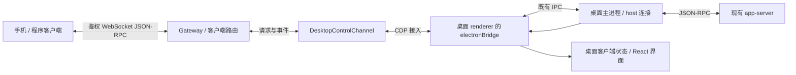

# 桌面程序控制通道设计

日期：2026-10-03。工作目录：`/Users/loock/myFile/codex-launcher`。
状态：用户已认可规格并要求直接实施。程序通道与受控验证已完成，真实桌面验收待完成；交付见 docs/desktop-control-channel.md。

## 用户目标与完成条件

提供一个代码可调用的通道，让手机前端和其他程序获取项目、会话及历史，发送消息，接收回复增量，处理审批。操作应进入正在运行的桌面连接，并能够反映在桌面会话中。保留启动器对原 codex-mobile 模式的支持。

本阶段实现 Codex；Dots 后续通过同一通道的独立适配器接入。MCP 工具封装不属于本阶段。

“打通”需分别报告：传输和请求关联、受控 Electron 集成、真实桌面行为。真实桌面必须验证列表与侧栏一致、同一会话双向收发及审批解决；受控窗口的成功不能替代真实桌面验收。

## 已有实现与选择依据

现有 `server/cdp/gateway.ts` 已提供鉴权 WebSocket `/ws`。`protocol.ts` 用 DOM 快照模拟列表、历史和事件，`/api/projects` 返回空数组。这不能提供完整项目与会话目录。

已安装 26.930.21537 的 preload 暴露 `electronBridge.sendMessageFromView`，入站通过 window message event 交给 renderer。主进程处理 mcp-request / mcp-response 并按 hostId 进入既有 AppServerConnection。宿主 RPC 与事件是私有契约；需要版本及能力探测。

选择保留 WebSocket 请求接口并替换内部传输。相比独立启动 app-server，这条路径有机会共享桌面连接与活动线程；相比 DOM 点击，能保留原始请求、turn、item 与审批身份。它是否完整更新桌面客户端状态仍需验证。

## 通道与模块职责

- DesktopControlChannel：request、respond、subscribe、status、close；管理版本探测、请求关联和连接世代。
- Renderer transport：安装有限监听器，调用既有 bridge，解析真实入站契约；不暴露任意 evaluate 或 shell。
- Gateway：身份验证、客户端请求 ID 映射、订阅过滤和错误返回。请求结果只回发起客户端，事件发给相应订阅者。
- 桌面状态适配：提供项目显示状态及会话状态快照，明确区分后端数据与桌面侧栏视图。
- 原 DOM adapter：只作为明确配置的旧模式；结构化通道失败时不能自动切换到点击发送。

## 对外接口

沿用 `/ws` 及 app-server 风格的 id/method/params/result/error。initialize 是网关握手，不对桌面现有 app-server 再发送 initialize。

| 范围 | 首阶段方法 |
| --- | --- |
| 状态 | initialize、desktop/status、desktop/subscribe、desktop/unsubscribe |
| 项目 | project/list、project/read；桌面显示项目通过专用状态适配读取 |
| 会话目录 | thread/list、thread/read、thread/search |
| 历史 | thread/turns/list、thread/items/list |
| 生命周期 | thread/start、thread/resume |
| 发送与中断 | turn/start、turn/interrupt |
| 审批回答 | 使用网关发出的服务器请求 id 回复 result |

方法采用白名单和参数校验，支持分页。hostId 在网关上下文中明确指定；不能把多个宿主的 threadId 混在一起。项目服务端 ID 与旧桌面显示 ID 必须保留映射。

desktop/subscribe 指定 hostId 与 threadIds；目录订阅另有明确范围。事件保留 hostId、threadId、turnId、itemId、method 和 params，附加 channelSessionId 与递增 sequence。sequence 仅用于当前网关连接周期的去重/缺口检测，不声称可无限回放。

首阶段代码同时提供小型 Node 调用示例：握手、列项目/会话、读历史、订阅目标会话、发送并等待 completed。代码示例不会自动连接真实账号发送验收消息。

## 请求结果与桌面更新

每个外部请求分配带随机会话前缀的内部 request ID，关联 clientId、hostId、method 与期限。桌面发回的 mcp-response.message 按内部 ID 匹配，再还原外部 ID。未知或其他桌面客户端的普通 response 不转发。

renderer → host 的审批回答形状为 mcp-response.response；host → renderer 的普通结果形状为 mcp-response.message。两种方向不能混用。

IPC invoke 返回只代表桥调用结束；请求必须等待异步业务 response。通知可能先于 response，订阅需要在发送前生效。

调用 turn/start 后，既有 renderer 的事件消费者也会收到通知；是否足以更新用户消息、乐观状态和当前页面需要实际核对。thread/resume 是业务订阅/恢复，不能称作桌面导航。如果原客户端状态没有更新，则必须定位会话管理器的公开于宿主的服务契约，不能以成功 response 结束验收。

## 事件、分块与审批

转发生命周期、agentMessage 增量、工具进度以及 serverRequest/resolved。同一窗口保留原桌面事件消费者，附加监听不能吞掉其事件。

已发现 chunked-message 协议。实现必须根据真实契约重组并限制内存；不能重复发 ACK 干扰原 renderer。未验证大消息重组时能力声明应说明限制并返回错误。

审批带原始 hostId、服务器 request ID、method、thread/turn/item 归属。网关 ID 为独立映射，不能泄漏为可回答任意桌面请求的自由入口。回答前检查 pending 和客户端订阅范围，并原子标记提交；重复或已 resolved 的回答拒绝。

桌面与手机可能同时回答。收到 resolved 时立即清除手机状态；若提交后尚未确认，报告结果未知并回读状态，不重发。主进程是否有提交前的最终有效性检查需验证，不能承诺消除跨窗口竞争。

附加监听只能获得之后的审批；启动前的 pending 必须从经验证的客户端/宿主快照恢复。未获得该快照时声明 approvalSnapshot=false，不能假装现有审批为空。

## 断线、超时与资源管理

- 页面重载、窗口变化或 CDP 断线使当前连接世代失效，所有 pending 返回明确错误。
- 写入已交给 bridge 后失联或超时返回 ACTION_WRITE_UNKNOWN，不重试发送、审批和创建。
- 只读请求允许由客户端主动重试；不在后台无界重连。
- 新连接重新探测契约、建立订阅和取快照，sequence 缺口触发快照恢复。
- 网关关闭只清理自身监听、计时器与 CDP 会话，不退出桌面，不退订桌面原客户端所有权。
- raw 参数、消息正文与认证信息不进入默认日志。

## 实施范围与验证

在已有隔离工作树修改 server/cdp 传输、协议和网关，保留手机现有协议形状。项目接口返回真实结果或明确不可用错误，不再用空数组掩盖缺能力。

验证采用 TDD：请求 ID 碰撞、多客户端结果隔离、先事件后 response、错误/超时、分块、断线未知写入、审批一次提交、已解决请求拒绝。受控 Electron fixture 提供 preload IPC 与状态消费者，以真实 CDP/WebSocket 验证整条传输，包含项目分页、会话历史、发送增量与审批。

当前真实应用工具曾明确拒绝访问 com.openai.codex；不得通过改用 CDP 执行真实操作绕过该拒绝。真实桌面验收需在允许的环境或用户人工操作下完成。未验收前交付状态保持“受控验证通过，真实桌面待验证”。

## 自查

设计已区分网关握手和桌面已有 initialize，区分业务恢复和 UI 导航，区分列表与历史分页，区分普通结果和服务器审批请求，区分受控集成与实际桌面。未确认的服务实例入口、审批快照、分块和 UI 更新均保留能力探测及失败边界。
